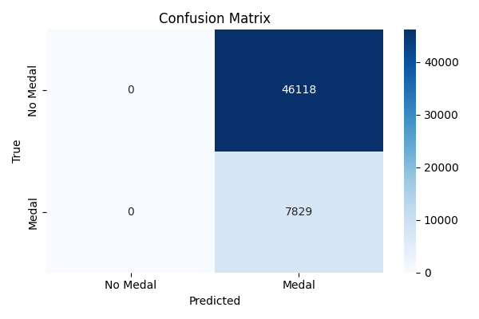

.

🏅 Olympics ML Dashboard
Ein vollständiges End‑to‑End‑Machine‑Learning‑Projekt zur Vorhersage olympischer Medaillenergebnisse – inklusive Datenpipeline, Feature Engineering, Modelltraining, Evaluation und einem interaktiven Streamlit‑Dashboard.

🎯 Projektüberblick
Dieses Projekt entwickelt ein Machine‑Learning‑System zur Vorhersage von olympischen Medaillenergebnissen basierend auf historischen Athletendaten (1896–2016).
Es kombiniert moderne Data‑Science‑Techniken mit einem interaktiven Dashboard zur explorativen Analyse und Modellvorhersage.

Hauptkomponenten
🧹 Datenbereinigung & Feature Engineering

🤖 Binäre Klassifikation (Medaille vs. keine Medaille)

🥇 Mehrklassen‑Modell (Gold / Silber / Bronze / None)

📈 Modelltraining & Evaluation

🖥️ Interaktives Streamlit‑Dashboard

📊 Explorative Analyse (Athleten, Länder, Sportarten)

📊 Demo (Vorschau)

Screenshots aus dem laufenden Streamlit‑Dashboard.

📂 Projektstruktur
Code
olympics-ml-dashboard/
│
├── data/                     # Roh- und bereinigte Datensätze
│   ├── raw/
│   └── cleaned/
│
├── notebooks/                # EDA, Experimente, Modelltests
│
├── src/
│   ├── features.py           # Feature Engineering
│   ├── train.py              # Trainingspipeline
│   ├── evaluate.py           # Evaluationsskripte
│   └── utils.py              # Hilfsfunktionen
│
├── models/                   # Gespeicherte Modelle (.pkl)
│
├── results/                  # Confusion Matrices, Feature Importance, Plots
│
├── dashboard/
│   ├── app.py                # Haupt-Dashboard
│   └── pages/                # Multi-Page Streamlit Seiten
│       ├── Athlete_Explorer.py
│       ├── Country_Insights.py
│       ├── ML_Prediction.py
│       └── Overview.py
│
├── requirements.txt          # Abhängigkeiten
└── README.md                 # Dokumentation
🧠 Machine‑Learning‑Pipeline
1) Datenvorbereitung
Entfernen fehlender Werte

Normalisierung & Skalierung

Encoding kategorialer Variablen

Feature‑Engineering:

Alter

BMI

Event‑Schwierigkeit

Länder‑Medaillenstatistiken

Historische Performance

2) Modellarchitektur
Stage 1: Binäres Modell → Medaille vs. keine Medaille

Stage 2: Multiclass‑Modell → Gold / Silber / Bronze / None

3) Evaluation
Accuracy, F1‑Score, ROC‑AUC

Confusion Matrix

Feature Importance

Cross‑Validation

🖥️ Streamlit‑Dashboard
Das Dashboard bietet:

🔍 Athlete Explorer – Filter nach Name, Land, Sport

🌍 Country Insights – Länderstatistiken & Medaillenverteilung

🧠 ML Prediction – Modellvorhersage basierend auf Eingaben

📊 Overview – Überblick über Athleten, Nationen & Sportarten

Starten:
bash
streamlit run dashboard/app.py
🚀 Installation & Setup
bash
git clone https://github.com/shiva-hadi1366/olympics-ml-dashboard.git
cd olympics-ml-dashboard
pip install -r requirements.txt
streamlit run dashboard/app.py
📈 Beispielergebnisse
Confusion Matrix (Binary Model)
(Beispiel – reale Werte aus deinem Projekt können hier eingefügt werden)

Feature Importance (Random Forest)

👤 Autor
Mohammadhadi Shiva  
Data Science Trainee | Machine Learning | Python | Streamlit
📍 Deutschland
🔗 GitHub: https://github.com/shiva-hadi1366